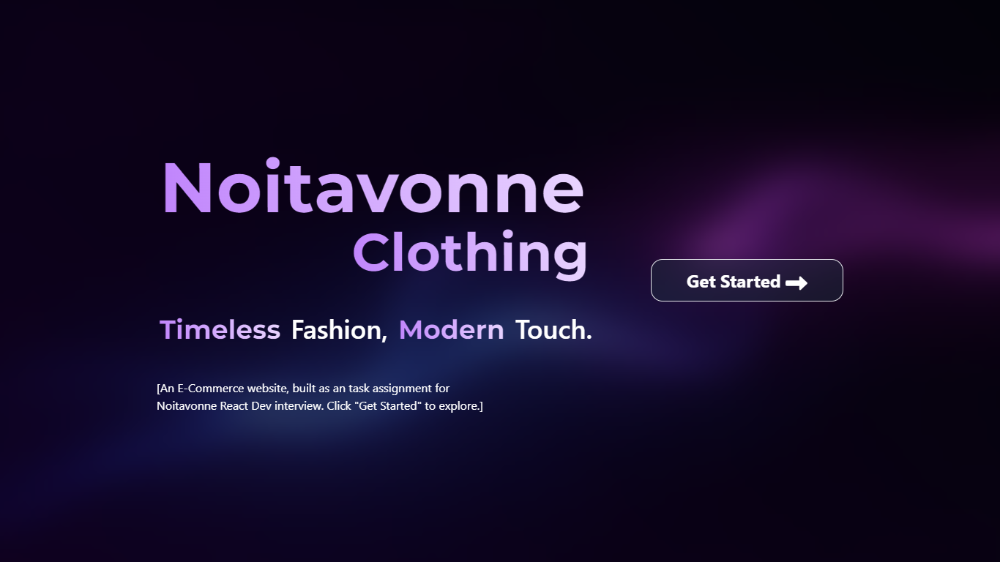
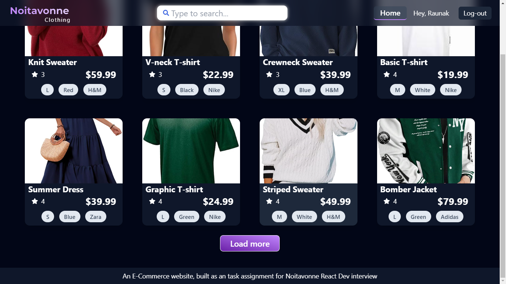
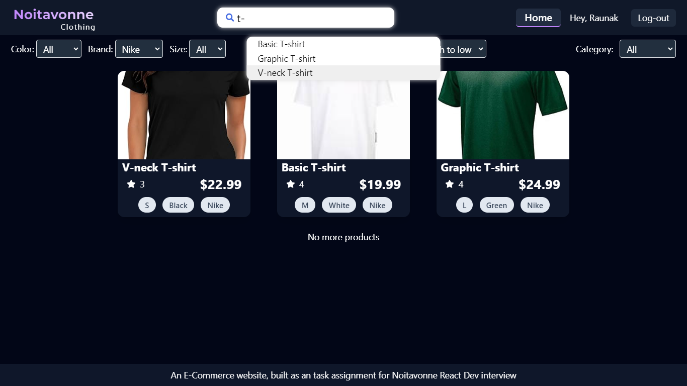
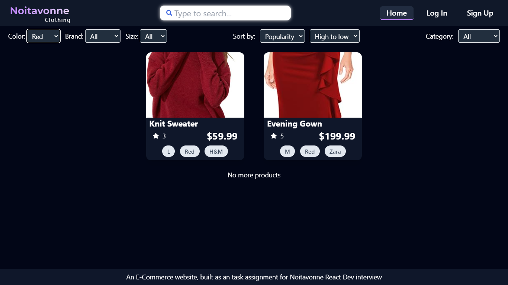
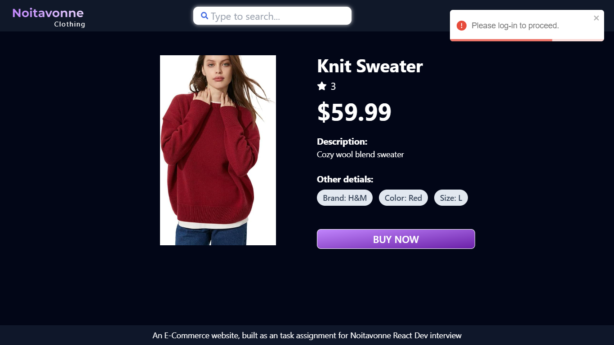
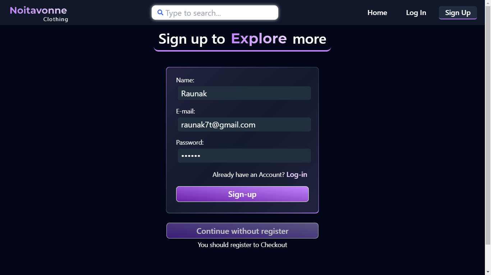
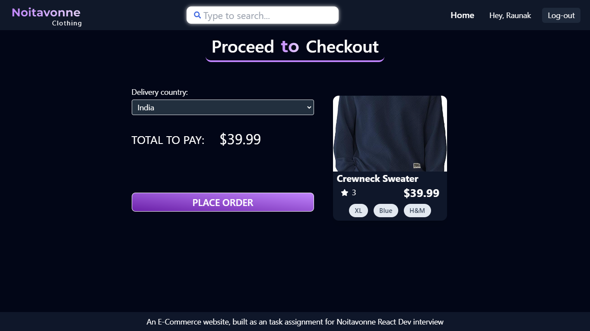

# NoitavonneClothing

### An E-Commerce website

Built as an task assignment for Noitavonne React Dev interview.

This is a full-fleged clothing e-commerce site. It's development phase was very fast-paced and still it follow best practices and efficiency.

## Table of Contents

0. [Demo](#demo)
1. [Features](#features)
2. [Technologies Used](#technologies-used)
3. [Installation](#installation)
4. [Setup Backend Server](#setup-backend-server)
5. [Usage](#usage)
6. [Testing](#testing)
7. [Folder Structure](#folder-structure)
8. [Contributing](#contributing)

## Demo









## Features

1. **User Registration**

   - Allows users to register with the application.

2. **Product Listing with Category**

   - Displays products categorized by type.
   - Implements lazy loading for category navigation.

3. **Search Bar**

   - Provides auto-suggestion and cached results for quick product searches.

4. **Filters**

   - Enables filtering products by size, color, brand, etc.

5. **Sorting**

   - Supports sorting products by price or popularity in ascending or descending order.

6. **Product Detail Page**

   - Shows detailed information about each product.

7. **Checkout Page**

   - Allows users to proceed with the purchase of selected products.

8. **Tests**
   - Includes test cases for purchasing products to ensure functionality.

## Technologies Used

- React.js
- Redux Toolkit
- Tailwind CSS (for responsive design)
- JSON Server (for backend simulation)
- Jest and React Testing Library (for testing)

## Installation

To install and run this project locally, follow these steps:

1. **Clone the repository**

   ```bash
   git clone https://github.com/Raunak7t/NoitavonneClothing.git
   cd NoitavonneClothing
   ```

2. **Install dependencies**

   ```bash
   npm install
   ```

## Setup Backend Server

This project uses JSON Server to simulate a backend API. Follow these steps to set up and run the backend server:

1. **Install JSON Server globally (if not already installed)**

   ```bash
   npm install -g json-server
   ```

2. **Start JSON Server**

   Navigate to the `backend` directory in your project and run:

   ```bash
   npx json-server db.json --port 5000
   ```

   This will start the JSON Server with the data provided in `db.json` file on `http://localhost:5000`.

## Usage

After completing the installation and backend setup, start the React application:

```bash
npm run dev
```

The application will be accessible at `http://localhost:3000`.

You can use the following credentials or you can register a new user:

E-mail:

```bash
 user@1.com
```

Password:

```bash
passme
```

## Testing

To run the tests for the project, use the following command:

```bash
npm test
```

This will execute the test cases using Jest and React Testing Library.

## Folder Structure (Overview)

```
NoitavonneClothing/
├── public/
├── src/
│   ├── __tests__
│   ├── assets/
│   ├── components/
│   ├── features/
│   │   ├── auth/
│   │   ├── products/
│   ├── pages/
│   ├── App.jsx
│   ├── index.css
│   ├── main.jsx
│   ├── store.js
│   └── ...
├── db.json
├── package.json
├── README.md
└── ...
```

## Contributing

This was a interview task, so no contributions were needed.
